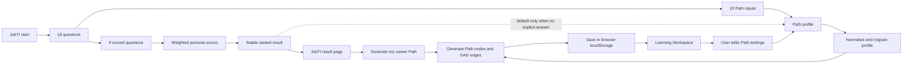
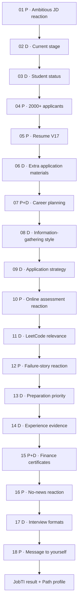
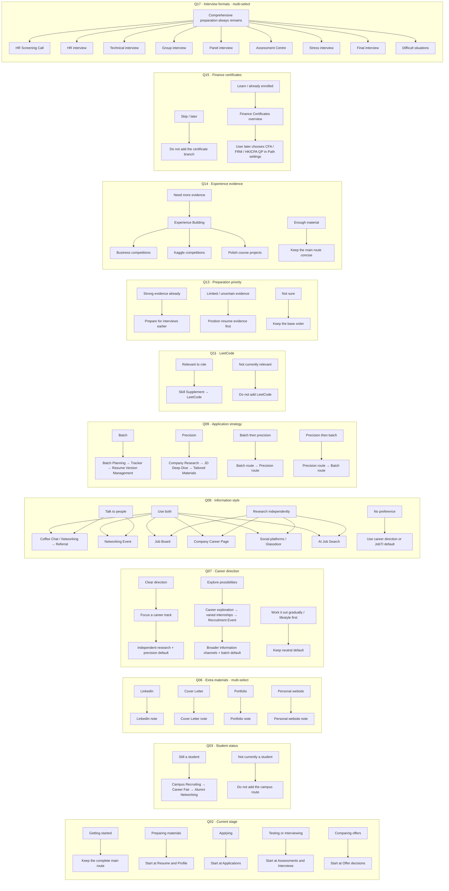
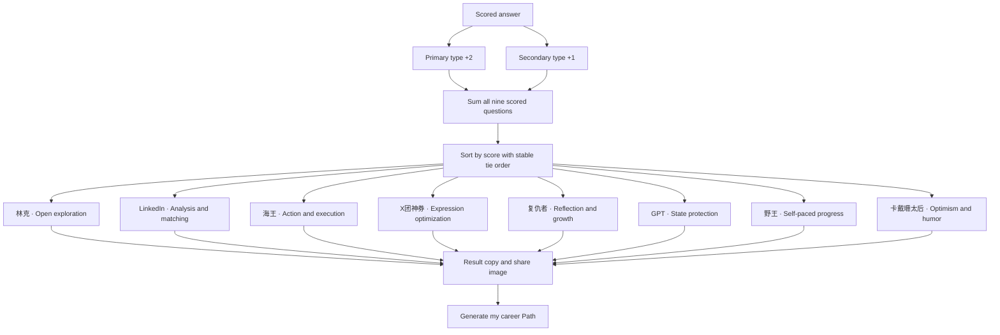

# JobTI → Result → Personalized Path Logic

This document describes the current Pilot Mode questionnaire and its explainable
Path-generation behavior. It separates personality scoring from practical Path
signals so a JobTI type never becomes a claim about career suitability.

## 1. End-to-end data flow

## 2. Questionnaire sequence

`P` means personality-only, `D` means direct Path input, and `P+D` affects both.

## 3. Practical answers and Path changes

## 4. Personality scoring and result

Each scored answer contributes `+2` to its primary type and `+1` to its secondary
type. The highest total wins. Ties use the stable order below, so identical answers
always produce the same result.

### Scored-question matrix

| Question | A (+2 / +1) | B (+2 / +1) | C (+2 / +1) | D (+2 / +1) |
|---|---|---|---|---|
| 01 Ambitious JD | 复仇者 / LinkedIn | 海王 / 林克 | 野王 / X团神券 | 卡戴珊太后 / GPT |
| 04 2000+ applicants | 野王 / LinkedIn | 卡戴珊太后 / 海王 | 林克 / GPT | X团神券 / 复仇者 |
| 05 Resume V17 | X团神券 / 复仇者 | LinkedIn / 海王 | 卡戴珊太后 / GPT | 林克 / 野王 |
| 07 Career planning | LinkedIn / X团神券 | 卡戴珊太后 / 林克 | 海王 / 复仇者 | GPT / 野王 |
| 10 Online assessment | 复仇者 / LinkedIn | 野王 / GPT | 海王 / 卡戴珊太后 | X团神券 / 林克 |
| 12 Failure story | 复仇者 / 野王 | LinkedIn / 海王 | X团神券 / 林克 | GPT / 卡戴珊太后 |
| 15 Certificates | GPT / 野王 | 复仇者 / LinkedIn | 海王 / 卡戴珊太后 | 林克 / X团神券 |
| 16 No news | LinkedIn / 复仇者 | 林克 / 海王 | GPT / 卡戴珊太后 | 野王 / X团神券 |
| 18 Message | 野王 / LinkedIn | 林克 / 卡戴珊太后 | 复仇者 / 海王 | GPT / X团神券 |

## Rendering the diagrams

1. Open <https://mermaid.live/>.
2. Copy one complete `mermaid` code block, excluding the Markdown backticks.
3. Paste it into the editor to render, export SVG/PNG, or share a link.

Alternatively, in draw.io choose **Arrange → Insert → Advanced → Mermaid**, then
paste one block. Keeping the four diagrams separate is recommended; combining all
branches into one canvas makes the product logic difficult to review.
