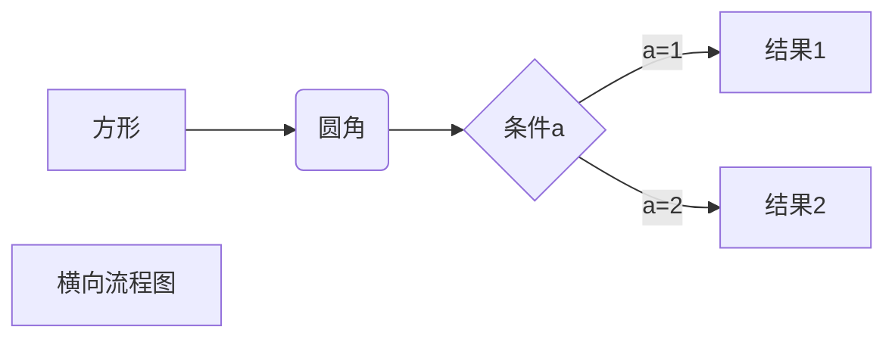
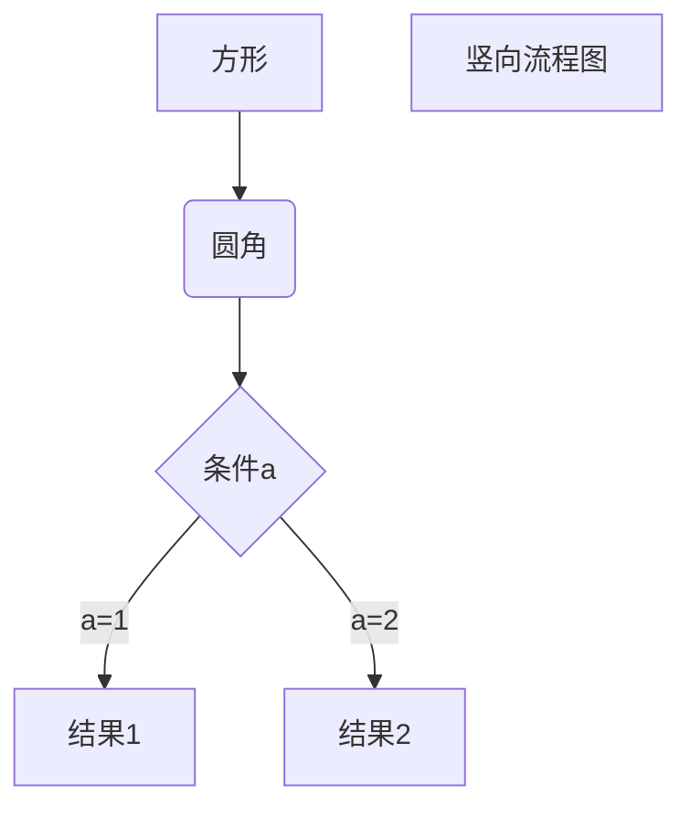
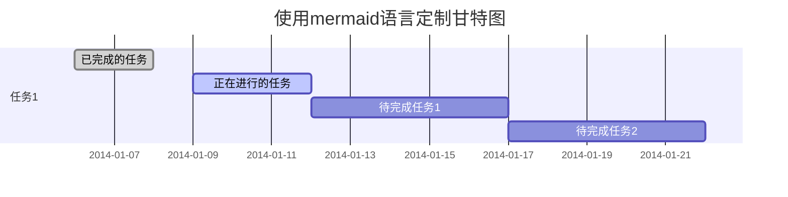

# Markdown Notes

> 作者：OP
>
> 创作时间：2021/05/29
>
> 上次修改时间：2024/11/05

## Markdown 简介
Markdown可以用软件`Typora`输入，也可以用`Visual Studio Code`输入。使用`Visual Studio Code`输入时，需要安装扩展来配置最好用的Markdown编译器，例如:

- [x] Markdown All in One
- [x] Markdown Footntoes

## 标题

Markdown支持6级标题。一级标题由`# + space + title`组成，二级标题由`## + space + title` 组成，以此类推，一直到六级标题。

```markdown
# 一级标题
## 二级标题
### 三级标题
#### 四级标题
##### 五级标题
###### 六级标题
```

## 字体

Markdown支持*斜体*、**粗体**、***粗斜体***、~~删除线~~、<u>下划线</u>，==高亮==。

_斜体_为`*内容*`或者`_内容_`，__粗体__为`**内容**`或者`__内容__`，___粗斜体___为`***内容***`或者```___内容___```，~~删除线~~为`~~内容~~`，<u>下划线</u>为`<u>内容</u>`，==高亮==为`==内容==`（需要先在软件`Typora`中`文件`$\rightarrow$`偏好设置`$\rightarrow$`Markdown`$\rightarrow$`Markdown扩展语法`$\rightarrow$ $\checkmark$`高亮`）。

```markdown
*斜体*
_斜体_
**粗体**
__粗体__
***斜粗体***
___斜粗体___
~~删除线~~
<u>内容</u>
==高亮==
```

## 段落和分割线

Markdown的段落是两个空格加回车`space + space + Enter`，但是有些编译器内可以直接回车。

Markdown支持星号`*`、减号`-`、下划线`_`建立分割线。一行中需有三个及以上的相同符号，可增加空格，但不能拥有其他字符。

---

```markdown
***
* * *
******
---
- - -
------
___
_ _ _
______
```

## 脚注

Markdown可以使用脚注[^脚注1]对文本进行补充，具体分为两部分：文中的脚注标识和具体注释。文中的脚注标识为`[^脚注标识]`，具体注释为`[^具体注释]`。

[^脚注1]:脚注的创建格式如下

```markdown
文中的脚注标识[^1]。
[^1]:具体的注释
```

## 序号

Markdown支持

1. 数字序号
2. 点序号：

* 实心圆点序号

  * 空心圆点序号
    * 方形实心点序号

等各类序号。数字序号为`1. + space`，点序号为`* + space`、`+ + space`、`- + space`。

```markdown
1. 数字标题
2. 数字标题
3. 数字标题
  * 空心圆点标题

* 实心圆点标题
  + 空心圆点标题
    - 放心实心点标题
```

## 引用

Markdown支持引用区块。引用区块为`> + 内容`，支持多个引用区块嵌套，嵌套即在第一个引用区块内输入`> + 内容`即可，如想在上一引用区块输入内容，按两次回车键`Enter`即可。

> Slogan總結：
>
> > 1. OP嘅slogan係
> >    * Perfectly balance
> >    * 三句歪理
>
> 其他名人名言：
>
> > blablabla

```markdown
> 一级引用
>> 二级引用
>>> 三级引用
```

## 代码

Markdown支持显示多种代码，可以显示代码片段或者代码区块。代码片段`print("Hello world!")`需要把代码用反引号``（`）``包裹起来。代码区块为````+ 代码语言 + Enter`，代码语言可以不指定。

```python
print("Hello world!")
```

```markdown
`代码片段`
​```R
R语言代码区块
​```
```

## 链接

Markdown支持输入链接。可以直接显示链接<https://www.google.com>，显示附有超链接的字段[Google](https://www.google.com)。直接显示链接`<URL>`，显示附有超链接的字段`[字段]（URL）`。

Markdown也可以将链接设置为变量，在文末为变量赋值[Baidu][1]。

```markdown
<url>
[字段](url)

[字段][变量]
[变量]:url
```

## 图片

Markdown支持插入图片。

插入图片方法为``。

Markdown也可以将图片设置为变量，在文末为变量赋值[钢铁侠][3]

[3]: ../../image/iron_man_markdown.jpg

Markdown无法指定图片的高度与宽度，但是可以通过缩放调整图片的大小。


语法为``。

```markdown


[显示字段][1]
[1]:url


```

## 表格

Markdown支持插入表格。表格用`|`和`-`来风格行和列。不过推荐用Typora的自定义表格。

 | 1   |   2   | 3   |
 | --- | :---: | --- |
 | a   |   b   | c   |

Markdown可以设置表格每一列文本对齐方式。右对齐为`-:`、左对齐为`:-`、居中对齐为`:-:`，默认情况下，表格为左对齐。

```markdown
|      |       |      |
| :--- | :---: | ---: |
|      |       |      |
|      |       |      |
```

## 勾选

Markdown支持制作to-do list。用`- + space + []`和`- + space + [X]`表示未勾选和已勾选。

* [ ] 未勾选

* [x] 已勾选

```markdown
- [ ]
- [X]
```

## 转义

Markdown可以通过转义字符显示特定字符，在特定字符前加反斜杠`\`即可。特定字符包括：反引号``(`)``、星号`(*)`、下划线`(_)`、花括号`({})`、方括号`([])`、小括号`(())`、井号`(#)`、加号`(+)`、减号`(-)`、英文句号`(.)`、感叹号`(!)`。

\`  \*  \_  \{}  \[]  \()  \#  \+  \-  \.  \!

```markdown
\`
\*
\_
\{}
\[]
\()
\#
\+
\-
\.
\!
```

## 数学公式

Markdown支持插入数学公式。输入`$$ + Enter`后，将数学公式用Tex或者LaTex语言编写。亦可以使用`$公式$`在行间编写LaTex，但是需要先在软件`Typora`中`文件`$\rightarrow$`偏好设置`$\rightarrow$`Markdown`$\rightarrow$`Markdown扩展语法`$\rightarrow$ $\checkmark$`内联公式`。
$$
\frac{A_1 \times A_2}{5^2}=B
$$

 ```markdown
 $$
 \frac{A_1 \times A_2}{5^2}=B
 $$
 ```

## 流程图

1. 横向流程图



2. 纵向流程图



3. 标准流程图

```flow
st=>start: 开始框
op=>operation: 处理框
cond=>condition: 判断框(是或否?)
sub1=>subroutine: 子流程
io=>inputoutput: 输入输出框
e=>end: 结束框
st->op->cond
cond(yes)->io->e
cond(no)->sub1(right)->op
```

4. 标准横向流程图

```flow
st=>start: 开始框
op=>operation: 处理框
cond=>condition: 判断框(是或否?)
sub1=>subroutine: 子流程
io=>inputoutput: 输入输出框
e=>end: 结束框
st(right)->op(right)->cond
cond(yes)->io(bottom)->e
cond(no)->sub1(right)->op
```

5. 甘特图


