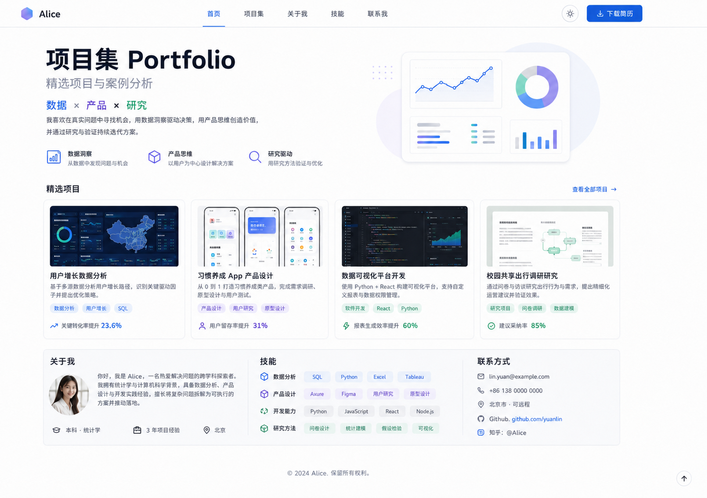
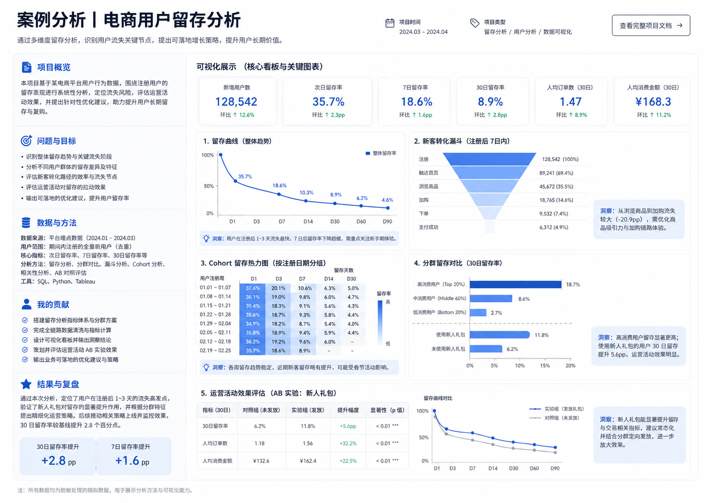
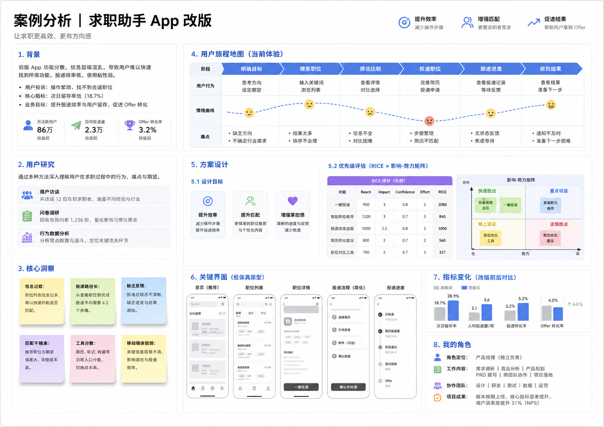

# 项目集 (Portfolio)

项目集是简历的有力补充，它能承载简历放不下的作品、分析过程、设计决策、文案、代码、实验或项目细节。它不仅仅是作品的堆砌，而是一组精心挑选的工作样本，旨在向招聘者展示你如何理解问题、做出取舍并最终达成结果。

## 何时使用项目集

首先，查看岗位描述（JD）是否提到 Portfolio、Work Sample、GitHub、Case Study 或 Project Experience。设计、产品、研究、数据、软件、内容与咨询类岗位尤其能从工作样本中受益。对于不需要查看作品的岗位，准备好在面试当中清晰阐述你做过的项目，就已经足够了。

## 如何选择项目

选择项目时，关键在于**相关性**和**可解释性**。代表项目可以来自课程、实习、比赛、个人探索或社团。可以关注以下几点：

*   它是否回应目标岗位会遇到的问题；
*   你的个人贡献能否清晰阐明；
*   是否有过程、取舍和结果可以展示；
*   内容能否合法、合规地公开。

**精选而非堆砌：** 少量高质量、解释清晰的项目，远比大量缺乏背景的堆砌更具说服力。确保最能体现你能力的项目容易被看见。

## 处理保密信息与团队项目

**保密信息：** 如果你的工作涉及公司数据、用户资料、专有代码或保密协议（NDA），**绝不能未经许可直接发布**。你可以使用脱敏数据、重建示例、只描述方法或展示高层级概念。拿不准时，务必先征得许可。

**团队项目：** 清晰呈现团队背景和项目整体情况，同时精确定义你在其中负责的范围和具体贡献。

## 将每个项目构建为案例分析

将每个项目构建为一篇**案例分析（Case Study）**，这能让招聘者快速理解你的思考过程和解决问题的能力。一个结构良好的案例通常包含以下要素：

1.  **问题与目标：** 你要解决什么问题？目标是什么？
2.  **背景与限制：** 用户、业务、时间、数据或资源等条件。
3.  **你的角色与贡献：** 你负责哪些环节？与谁协作？具体做了什么？
4.  **过程与选择：** 你如何研究、分析、设计方案、迭代？为什么做出这些选择？
5.  **结果与证据：** 你的工作带来了什么？用数据、反馈、上线情况或学到的经验来证明。
6.  **复盘与展望：** 如果继续做，你会如何调整或改进？

为图片、图表、代码和原型都配上简要解释。招聘者通常快速浏览，因此请先给出结论和个人贡献，再引导感兴趣的人深入细节。

## 用可视化帮助招聘者快速理解项目

项目集中的 Visualization，重点是帮助招聘者快速理解你面对的问题、解决过程、判断和结果。图片、图表、原型和流程图都应该承担明确的信息功能，而不是单纯作为装饰。

### 可以优先展示这些内容

- **结果与关键指标：** 如果项目有明确结果，可以用数字卡片、前后对比、趋势图或简单图表突出最重要的变化，例如转化率提升、效率改善、用户增长或性能变化。
- **过程与思考：** 用户旅程、流程图、架构图、研究框架、优先级矩阵等，都可以帮助招聘者快速理解你是怎样分析问题和做出决策的。
- **最终产出：** 产品界面、Dashboard、设计稿、代码片段、报告页面或实际成果截图，可以直观证明你完成了什么。
- **关键证据：** 用户反馈、实验结果、数据分析、测试结果等，可以放在对应结论旁边，帮助读者理解你的判断依据。

### 每张图都应该回答一个问题

放入一张图之前，可以先明确它希望招聘者看懂什么。例如：

- **留存曲线：** 用户主要在哪个阶段流失？
- **用户旅程地图：** 用户在哪些步骤遇到了问题？
- **系统架构图：** 这个项目的技术方案是怎样组织的？
- **改版前后对比：** 你的方案带来了什么变化？
- **原型图：** 最终方案如何解决前面发现的问题？

如果一张图需要读者花很长时间研究才能理解，可以进一步简化，或者补充标题和说明。

### 图表旁边直接写出你的发现

尽量避免只展示完整 Dashboard 或一整页分析结果。可以在最重要的数据旁边补一句具体结论，例如：

> 注册后第 1–3 天是用户流失最明显的阶段，因此后续优化重点放在新用户首次体验。

或者：

> 简化投递流程后，平均操作步骤从 6 步减少到 3 步，投递完成率随之提升。

这样招聘者即使只快速浏览，也能理解这张图为什么值得看。

### 控制每个页面的信息密度

一个案例中不需要展示所有分析过程。可以优先保留：

**背景与问题 → 关键分析或过程 → 你的决策 → 最终方案 → 结果**

同一种信息尽量只保留最有代表性的几张图。例如，做过十几张分析图，可以选出真正影响决策的两三张，再把完整分析放进 GitHub、附录或独立 Dashboard。

### 让可视化本身也具备可读性

发布前可以检查：

- 图表标题是否直接说明内容；
- 坐标、单位、图例和时间范围是否清楚；
- 字号是否在普通笔记本屏幕上也能阅读；
- 颜色是否承担明确含义；
- 截图中是否包含无关菜单、浏览器栏或大量空白；
- 重要区域是否可以通过裁剪、标注或放大突出；
- 每张图附近是否能看到背景、你的贡献或最终结论。

### 三种项目集页面示例

下面三张示例图分别展示了项目集首页、数据分析案例和产品改版案例。它们不是需要照搬的模板，可以重点观察信息层级、证据与结论如何对应。

*项目集首页可以先帮助招聘者快速理解你是谁、做过哪些代表项目，再提供进入完整案例的入口。*

*数据分析案例可以把关键指标、分析过程和业务建议放在同一条叙事线上，让图表直接支撑结论。*

*产品案例可以沿着“发现问题—形成判断—设计方案—验证结果”的顺序组织证据。*

## 针对不同岗位调整项目集重点

你的项目集侧重点应根据目标岗位而调整：

| 方向         | 更值得展示                                           |
| :----------- | :--------------------------------------------------- |
| 数据分析     | 问题定义、数据处理、SQL、指标、图表与业务建议      |
| 产品         | 用户问题、需求判断、优先级、方案取舍与结果         |
| 软件开发     | 架构、核心实现、代码质量、测试、部署与技术权衡     |
| 设计         | 研究、信息架构、迭代过程、可用性与视觉系统         |
| 咨询/商业分析 | 问题拆解、假设、分析框架、洞察与建议               |
| 内容/市场    | 受众、策略、创作过程、渠道数据与复盘               |

## 选择呈现形式并确保可访问性

**呈现形式：**

*   **PDF：** 适合发送和面试展示。
*   **Notion/在线文档：** 适合快速组织案例，易于更新。
*   **GitHub：** 最适合代码、详细的 README 和版本记录。
*   **个人网站：** 作为统一入口，展示更全面的专业身份。

无需追求“高级”工具，稳定、清晰、手机可读且链接有效的项目集，本身就已足够专业。**务必在手机、平板和电脑等设备上测试所有链接和可读性。**

## 审阅与优化你的项目集

发送前，可以请一个不了解项目的人快速浏览，然后问：TA 能否说出你解决的问题、你的贡献和最终结果？如果答案模糊，应优先调整信息层级，而非继续增加装饰。

## 与其他平台整合

你精心准备的项目集可以同时放进简历、LinkedIn 和个人主页。LinkedIn 官方也允许在 Profile 中加入 Projects 和媒体链接，确保你的作品在多个触点都能被看见。

---
**来源：**

*   [宾夕法尼亚大学职业服务中心 — 如何在没有工作经验的情况下创建在线作品集](https://careerservices.upenn.edu/blog/2022/11/22/how-to-create-an-online-portfolio-even-when-you-dont-have-work-experience/)
*   [宾夕法尼亚大学职业服务中心 — 简历](https://careerservices.upenn.edu/channels/resume/)
*   [宾夕法尼亚大学职业服务中心 — 协调简历/履历与在线形象](https://careerservices.upenn.edu/videos/coordinating-your-cv-resume-with-your-online-presence/)
